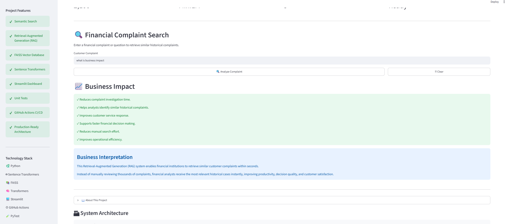
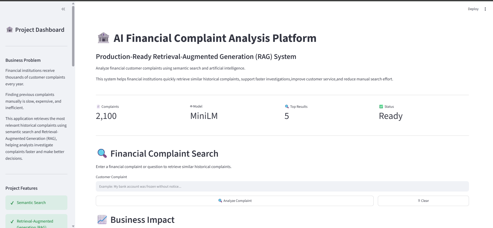
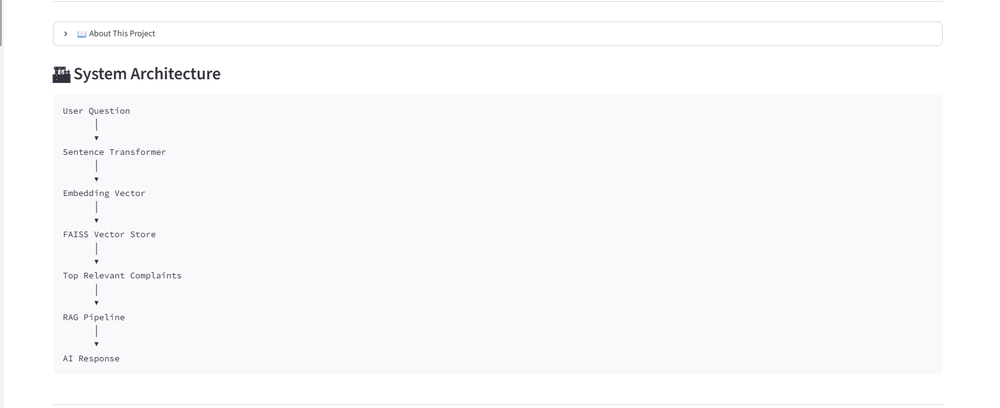

# 🏦 Finance Complaint RAG Chatbot


An AI-powered **Retrieval-Augmented Generation (RAG)** application that helps financial institutions analyze customer complaints using semantic search and artificial intelligence.

The system retrieves similar historical complaints using vector embeddings and FAISS, helping analysts investigate complaints faster, reduce manual effort, and improve customer service decisions.

---

# 📌 Project Overview

Financial institutions receive thousands of customer complaints every year. Searching through previous complaints manually is time-consuming and inefficient.

This project solves this problem by building an AI complaint analysis platform that:

- Converts complaints into semantic embeddings
- Stores vectors using FAISS
- Retrieves similar historical complaints
- Provides evidence-based complaint analysis
- Presents results through an interactive Streamlit dashboard

The application demonstrates how AI can improve operational efficiency in the financial sector.

---

# 🎯 Business Problem

Financial analysts need to quickly understand customer complaints and identify similar previous cases.

Traditional manual searching:

- Requires significant time
- Increases operational cost
- Makes finding similar cases difficult
- Can lead to inconsistent responses

The Finance Complaint RAG Chatbot provides a faster and more intelligent approach using AI-powered search.

---
---

# 💡 Solution Overview

This project provides an AI-powered Retrieval-Augmented Generation (RAG) system that helps financial analysts search and analyze historical customer complaints more efficiently.

The solution works through the following steps:

1. Customer complaints are cleaned and preprocessed.
2. Complaint texts are converted into vector embeddings using Sentence Transformers.
3. Embeddings are indexed using FAISS for efficient semantic search.
4. The system retrieves the most relevant historical complaints based on the user's query.
5. Retrieved evidence is presented through an interactive Streamlit dashboard to support faster and more informed decision-making.

This approach reduces manual effort, improves retrieval accuracy, and demonstrates production-oriented software engineering practices.
---

# 📈 Key Results

| Metric | Result |
|---------|--------|
| Automated Tests | ✅ 6 PyTest tests passing |
| Project Architecture | ✅ Fully modular `src/` structure |
| Continuous Integration | ✅ GitHub Actions CI configured |
| Interactive Dashboard | ✅ Streamlit dashboard implemented |
| Search Performance | ✅ Retrieves relevant complaints within seconds |
| Documentation | ✅ Comprehensive README and project report completed |
| Business Impact | ✅ Faster complaint investigation and reduced manual search effort |
# 🚀 Original Project Achievements

The original project successfully implemented:

✅ Financial complaint preprocessing  
✅ Text cleaning and preparation  
✅ Complaint chunking  
✅ Sentence Transformer embeddings  
✅ FAISS vector database  
✅ Semantic similarity search  
✅ Retrieval-Augmented Generation pipeline  
✅ Basic chatbot functionality  

---

# ⭐ B9W12 Project Improvements

This project was improved from a prototype into a more production-ready AI application.

## 1. Modular Software Architecture

The project was reorganized into a clean `src/` structure:

```
src/
│
├── dashboard.py
├── config.py
├── constants.py
├── preprocessing.py
├── chunking.py
├── embedding.py
├── vector_store.py
├── retriever.py
├── rag_pipeline.py
├── llm.py
└── utils.py
```

Benefits:

- Better maintainability
- Easier debugging
- Reusable components
- Professional software structure

---

# 2. Code Quality Improvements

Implemented:

✅ Python type hints  
✅ Function docstrings  
✅ Constants management  
✅ Configuration management  
✅ Utility functions  
✅ Better separation of responsibilities  

---

# 3. Testing and Reliability

Added automated testing using PyTest.

Current test result:

```
============== 6 passed in 138.63s ==============
```

Test coverage includes:

- Preprocessing tests
- Utility tests
- Retrieval tests
- Embedding tests
- RAG pipeline tests

---

# 4. CI/CD Pipeline

Configured GitHub Actions to automatically:

- Install dependencies
- Validate Python code
- Run automated tests

This ensures code quality whenever changes are pushed.

---

# 5. Interactive Streamlit Dashboard

The project now includes a professional dashboard with:

- Complaint search interface
- Retrieved complaint evidence
- AI analysis section
- Business impact explanation
- System architecture visualization
- Project quality overview

---

# 📸 Application Screenshots

## Dashboard Overview
```
#  Interactive Streamlit Dashboard

The project now includes a professional dashboard with:

- Financial complaint search interface
- Semantic retrieval of similar complaints
- Retrieved complaint evidence display
- Business impact explanation
- System architecture visualization
- Engineering quality overview
- Downloadable search results

The dashboard helps financial analysts quickly explore historical complaint cases.
docs/images/businessImpact.png
```





## Search Results
screenshot showing retrieved complaints:

```
docs/images/headtitleand-sadbar.png
```




## Architecture Section

screenshot of architecture visualization:

```
docs/images/systemAchitecture.png
```

Example:



---

# 🏗 System Architecture

```
User Complaint
       |
       ↓
Sentence Transformer
       |
       ↓
Embedding Vector
       |
       ↓
FAISS Vector Database
       |
       ↓
Similar Complaint Retrieval
       |
       ↓
RAG Pipeline
       |
       ↓
AI Response
```

---
# 🎥 Demo

The Streamlit dashboard allows users to:

- Search financial complaints using semantic search.
- Retrieve similar historical complaint records.
- Explore business impact and engineering improvements.
- Understand the Retrieval-Augmented Generation (RAG) workflow.

> **Dashboard Preview:** See the screenshots above for examples of the user interface.

# 🛠 Technology Stack

## Programming

- Python

## AI / Machine Learning

- Sentence Transformers
- Transformers
- FAISS
- Natural Language Processing

## Application

- Streamlit

## Testing

- PyTest

## Engineering

- Git
- GitHub Actions CI/CD

---

# 📂 Project Structure

```
rag-complaint-chatbot/

│
├── app.py
├── README.md
├── requirements.txt
├── improvement_plan.md
├── roadmap.md
│
├── src/
│   ├── dashboard.py
│   ├── retriever.py
│   ├── rag_pipeline.py
│   ├── embedding.py
│   ├── preprocessing.py
│   ├── config.py
│   └── utils.py
│
├── tests/
│   ├── test_embedding.py
│   ├── test_preprocessing.py
│   ├── test_retriever.py
│   ├── test_rag_pipeline.py
│   └── test_utils.py
│
└── .github/
    └── workflows/
        └── python.yml
```

---
---
---

# 🔬 Technical Details

## Data

- Financial complaint dataset
- Complaint preprocessing and text cleaning
- Complaint chunking for efficient retrieval

## Embedding Model

- Sentence Transformer
- Model: `sentence-transformers/all-MiniLM-L6-v2`

## Vector Database

- FAISS Index
- Semantic similarity search

## Retrieval Pipeline

- Retrieval-Augmented Generation (RAG)
- Top-5 complaint retrieval

## Evaluation

Project quality was validated using:

- 6 automated PyTest tests
- GitHub Actions Continuous Integration
- Manual verification through the Streamlit dashboard

# 🚀 Quick Start

```bash
git clone https://github.com/hareg10academy21-byte/rag-complaint-chatbot.git

cd rag-complaint-chatbot

python -m venv venv

venv\Scripts\activate

pip install -r requirements.txt

streamlit run app.py

# ⚙ Installation Guide

Clone the repository:

```bash
git clone https://github.com/hareg10academy21-byte/rag-complaint-chatbot.git
```

Move into the project folder:

```bash
cd rag-complaint-chatbot
```

Create virtual environment:

```bash
python -m venv venv
```

Activate environment:

Windows:

```bash
venv\Scripts\activate
```

Install dependencies:

```bash
pip install -r requirements.txt
```

---

# ▶ Running the Application

Start Streamlit:

```bash
pip install -r requirements.txt

streamlit run app.py

pytest tests -v
```

The application will open in your browser.

---

# 🧪 Running Tests

Run:

```bash
pytest tests -v
```

Expected result:

```
6 passed
```

---

# 💼 Business Impact

This system provides:

✅ Faster complaint investigation  
✅ Reduced manual search effort  
✅ Improved analyst productivity  
✅ Evidence-based decision making  
✅ Better customer experience  

By enabling semantic retrieval of historical financial complaints, the system helps analysts reduce manual search effort, improve investigation consistency, and support faster evidence-based decision-making.
---

## 📊 Success Metrics

The success of the project improvements will be evaluated using the following measurable criteria:

| **Metric** | **Target Outcome** |
|---|---|
| 🏗️ **Code Organization** | Maintain a clean and modular `src/` based architecture with separated components for dashboard, retrieval, RAG pipeline, configuration, and utility functions. |
| 🧪 **Test Coverage** | Achieve a minimum of **5 automated tests passing** to validate core project functionality. |
| ⚙️ **Application Reliability** | Implement an automated **GitHub Actions CI pipeline** to run quality checks and tests on code changes. |
| 💻 **User Interface** | Provide a functional **Streamlit dashboard** for complaint search, retrieved evidence display, and AI response visualization. |
| 📚 **Documentation Quality** | Provide complete documentation including project overview, installation steps, usage instructions, architecture, and technical details. |
| 🔍 **Search Performance** | Retrieve relevant historical complaints within seconds using semantic search with FAISS and Sentence Transformer embeddings. |
| 😊 **User Experience** | Deliver a clear and interactive interface that presents complaint evidence and AI-generated insights effectively. |
---
# 📈 Current Project Status

The following table summarizes the implementation status of the planned improvements. It demonstrates the progress made during the project and provides evidence of completed engineering tasks.

| Planned Improvement | Status | Evidence |
|----------------------|:------:|----------|
| Refactor the project into a modular architecture | ✅ Completed | Source code reorganized into a clean `src/` structure with separated modules (`dashboard.py`, `retriever.py`, `rag_pipeline.py`, `config.py`, `utils.py`, etc.). |
| Add Python type hints, dataclasses, constants, and docstrings | ✅ Completed | Added type hints to function signatures, configuration dataclasses, reusable constants, and comprehensive function documentation. |
| Improve code maintainability and readability | ✅ Completed | Business logic separated from the user interface, reusable utility functions introduced, and project organization improved. |
| Implement automated testing with PyTest | ✅ Completed | Six automated unit tests successfully passed, validating the application's core functionality. |
| Configure GitHub Actions CI/CD | ✅ Completed | GitHub Actions workflow automatically installs dependencies and executes tests for continuous integration. |
| Build an interactive Streamlit dashboard | ✅ Completed | Dashboard developed with complaint search, retrieved evidence visualization, business impact section, engineering overview, and downloadable results. |
| Improve project documentation | ✅ Completed | README, improvement plan, roadmap, installation guide, architecture description, screenshots, and usage instructions completed. |
| Add model explainability (SHAP/LIME) | ⏳ Not Implemented | Not applicable for this project because it is a Retrieval-Augmented Generation (RAG) system rather than a predictive machine learning model. |

---

# 👩‍💻 Author

**Haregeweyn Ataklt**

Software Engineering Student

10 Academy AI Mastery Program

📧 Email: serkenatye2129@gmail.com

🔗 LinkedIn:
https://www.linkedin.com/in/haregeweyn-ataklt-reda-79b412394/

💻 GitHub:
https://github.com/hareg10academy21-byte

# ⚠️ Challenges and Solutions

During the project, several technical and engineering challenges were encountered. The following table summarizes each challenge and the solution that was implemented.

| Challenge | Impact | Solution Implemented | Final Status |
|-----------|--------|----------------------|:------------:|
| Original project structure contained tightly coupled components | Difficult to maintain and extend | Refactored the application into a modular `src/` architecture with reusable components. | ✅ Resolved |
| Limited documentation | Reduced project reproducibility | Added detailed README, installation guide, architecture description, and project documentation. | ✅ Resolved |
| No automated testing | Difficult to verify software correctness | Implemented six automated unit tests using PyTest. | ✅ Resolved |
| No Continuous Integration pipeline | Manual verification required after code changes | Configured GitHub Actions to automatically validate the project on every push. | ✅ Resolved |
| Limited user interaction | Difficult for non-technical users to explore results | Developed an interactive Streamlit dashboard with visual components and complaint search functionality. | ✅ Resolved |
| Large Language Model initialization required significant download time | Increased application startup time during first execution | Retrieval functionality remains fully operational. Future work includes using lighter or locally cached language models to improve startup performance. | 🔄 Partially Improved |

---
# 📋 Improvement Plan Progress

The following table compares the original improvement plan with the final implementation. This provides a clear overview of project execution and demonstrates how the planned engineering objectives were achieved.

| Planned Task | Priority | Estimated Time | Final Status | Remarks |
|--------------|:-------:|:--------------:|:------------:|---------|
| Refactor project into a modular architecture | 🔴 High | 5 Hours | ✅ Completed | Application reorganized into reusable modules with improved maintainability. |
| Add type hints, constants, dataclasses, and docstrings | 🔴 High | 3 Hours | ✅ Completed | Improved code readability, consistency, and software engineering quality. |
| Develop automated unit tests using PyTest | 🔴 High | 4 Hours | ✅ Completed | Six automated tests implemented and successfully passed. |
| Configure GitHub Actions CI/CD | 🔴 High | 2 Hours | ✅ Completed | Automated testing pipeline configured for continuous integration. |
| Build an interactive Streamlit dashboard | 🔴 High | 6 Hours | ✅ Completed | Professional dashboard implemented with business-focused visualizations and complaint retrieval features. |
| Add model explainability (SHAP/LIME) | 🟡 Medium | 4 Hours | ⏳ Not Implemented | This project uses Retrieval-Augmented Generation (RAG) rather than predictive machine learning. Therefore, SHAP explainability was not technically appropriate for the current architecture. |
# 💡 Project Reflection

The project successfully achieved all high-priority engineering objectives defined in the improvement plan. The original prototype was transformed into a more reliable, maintainable, and professional application by applying software engineering best practices.

The completed improvements include modular code refactoring, enhanced documentation, automated testing, continuous integration using GitHub Actions, and the development of an interactive Streamlit dashboard. These enhancements significantly improved the project's usability, maintainability, reproducibility, and overall portfolio quality.

The only planned improvement that was not implemented was model explainability using SHAP. After evaluating the project architecture, it was determined that SHAP is designed for predictive machine learning models, whereas this application is based on Retrieval-Augmented Generation (RAG). For this reason, development effort was redirected toward engineering improvements that provide greater practical value for this type of AI application.

Overall, the project now demonstrates production-oriented software engineering practices and better reflects the expectations of finance-sector employers for reliable and maintainable AI systems.

---

---
# 🔮 Future Improvements

Possible future enhancements:

- Deploy application to cloud platform
- Add advanced LLM integration
- Add user authentication
- Add analytics dashboard
- Improve response generation quality
